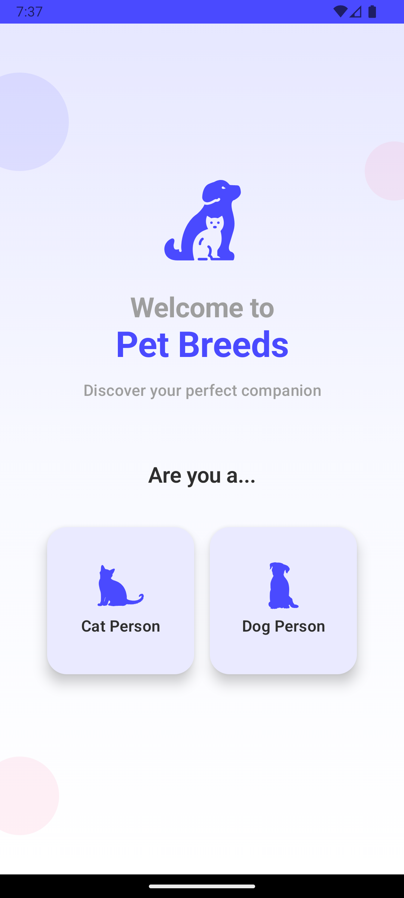
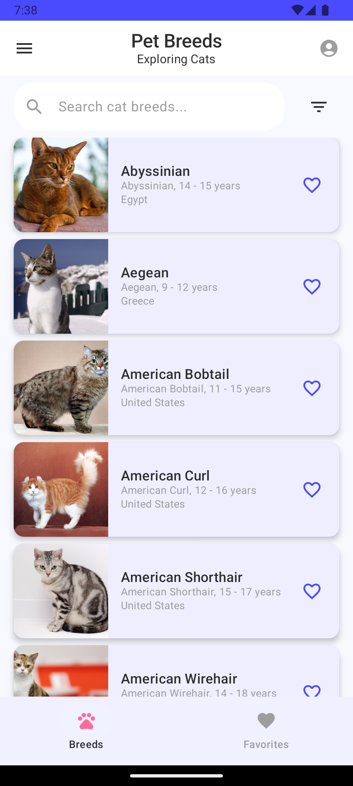
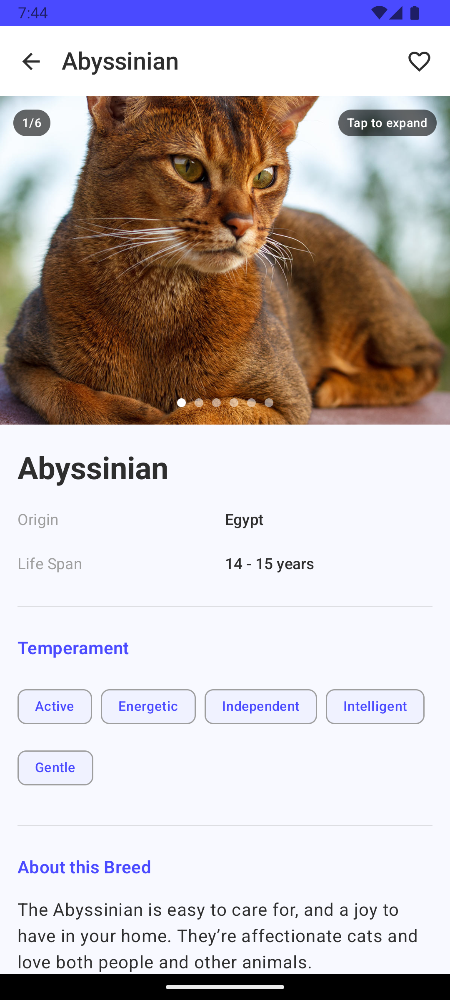
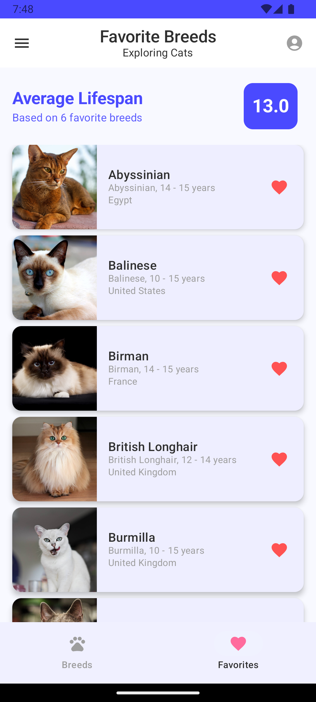

# Pet Breeds App

A modern Android application built with Jetpack Compose that allows users to explore cat and dog breeds, mark favorites, and view detailed breed information. The app implements Clean Architecture with MVVM pattern and provides both online and offline functionality.

## Screenshots

| Onboarding | Breeds List                                | Details Screen                         | Favorites                                |
|------------|--------------------------------------------|----------------------------------------|------------------------------------------|
|  |  |  |  |

## Features
api
implementation
### Core Requirements
- Cat and dog breed listings with images and names
- Search functionality to filter breeds by name
- Favorite marking with persistent storage
- Favorites screen with average lifespan calculation
- Detailed breed view with comprehensive information
- Navigation between screens using Jetpack Navigation

### Additional Features
- **Dual Pet Support**: Switch between cats and dogs with different themes
- **Offline Functionality**: Browse cached data without internet connection
- **Advanced Filtering**: Filter breeds by lifespan range
- **Image Gallery**: Multiple images per breed with full-screen viewer
- **Pagination**: Efficient loading of large datasets
- **Pull-to-Refresh**: Manual data refresh capability
- **Modern UI**: Material Design 3 with smooth animations

## Architecture

The app follows Clean Architecture principles with clear separation of concerns:

```
com.example.petbreeds/
   ├── core/               
   │   ├── data/           
   │   └── ui.theme/ 
   ├── data/               
   │   ├── api/ 
   │   │   ├── dto/   
   │   │   ├── service/   
   │   │   └── interceptor/         
   │   ├── local/    
   │   │   ├── dao/   
   │   │   ├── database/   
   │   │   └── entity/         
   │   ├── mapper/               
   │   └── repository/
   ├── domain/               
   │   ├── model/
   │   ├── repository/          
   │   └── usecase/          
   ├── presentation/      
   │   ├── onboarding/   
   │   ├── breeds/    
   │   ├── components/    
   │   ├── favorites/   
   │   ├── details/     
   │   ├── navigation/     
   │   ├── settings/     
   │   └── theme/    
   ├── di/               
   └── utils/        
```

### Data Flow
1. UI observes ViewModels via StateFlow
2. ViewModels execute Use Cases
3. Use Cases call Repository interfaces
4. Repositories coordinate between API and local database
5. Room database provides offline storage

## Tech Stack

**Architecture & Patterns**
- Clean Architecture with MVVM
- Repository Pattern
- Dependency Injection with Hilt

**UI Framework**
- Jetpack Compose
- Material Design 3
- Navigation Compose

**Data & Networking**
- Room Database for local storage
- Retrofit + OkHttp for networking
- DataStore for user preferences
- Coil for image loading

**Reactive Programming**
- Kotlin Coroutines
- StateFlow & Flow

## Setup

### Prerequisites
- Android Studio Hedgehog or newer
- Min SDK 24 (Android 7.0)
- Target SDK 34

### API Keys Setup

1. Get your free API keys:
   - Cat API: https://thecatapi.com/signup
   - Dog API: https://thedogapi.com/signup

2. Create `local.properties` file in the project root (if not exists)

3. Add your API keys:
```properties
CAT_API_KEY=your_cat_api_key_here
DOG_API_KEY=your_dog_api_key_here
```
## Build & Run

1. Clone the repository
2. Set up your API keys (see above)
3. Sync project with Gradle files
4. Run on emulator or device (API 24+)

## Testing

```bash
# Run unit tests
./gradlew test

# Run instrumented tests
./gradlew connectedAndroidTest
```

## License

This project was created as a technical challenge for Sword Health Trainee Program 2025.